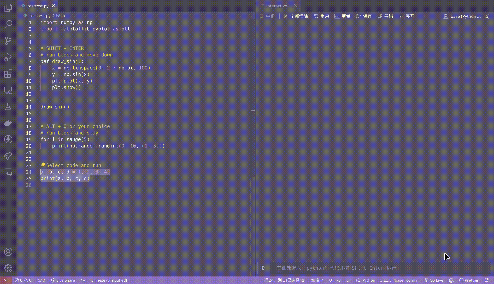

# run-in-jupyter README

This VSCode extension enables the execution of selected code snippets or entire code blocks from a Python file within a Jupyter environment.

## How to use

1. <kbd>Shift</kbd>+<kbd>Enter</kbd> for **Running** the current block of code and make your cursor **Move Down** to the start of next block. So you can do this repeatedly.
2. <kbd>Alt</kbd>+<kbd>Q</kbd> for **Just Running** the current block of code. This may be useful for testing some random-result code. You can customize the keybinding in VSCode.
3. Select some code. Either 1 or 2 will run the selected code.

## Release Notes

I used to be a Atom Hydrogen user, but Atom is down. This extension is a simple substitute for Hydrogen. It is not as powerful as Hydrogen, but it is enough for me to use.

### 0.1.0

- Initial release
- Support for running Python code in Jupyter notebooks

### 0.1.1

- code block infer bug fix
